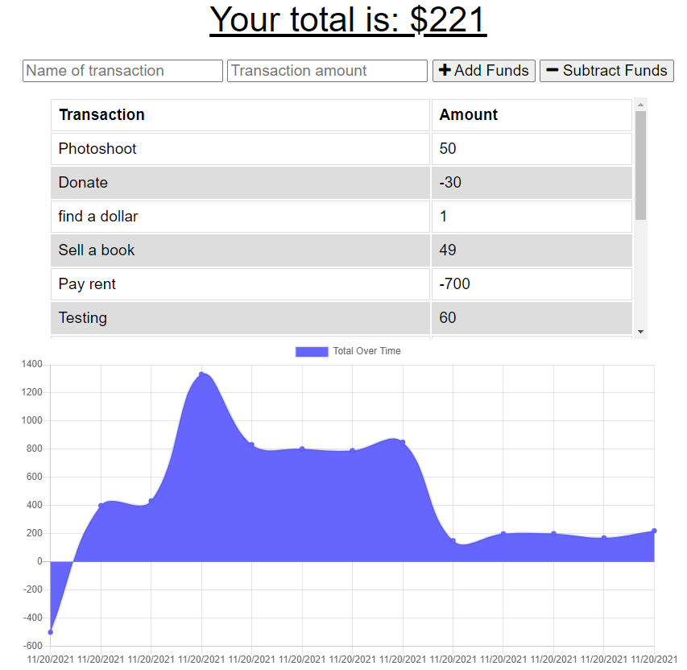

# E-Commerce Back end

## Description 
This app allows users to balance their budget whether they are online or offline. If the user enters transactions offline, the total should be updated when they're brought back online.

## Installation
You will need to clone the repo and install dependencies using npm i. Then start the server using npm start

## Built with 
- HTML/CSS
- Express.js
- React
- Node, MongoDB, JSX

## Screenshot

## Deployed Heroku Link
https://whispering-badlands-17410.herokuapp.com/
